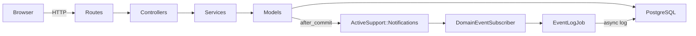
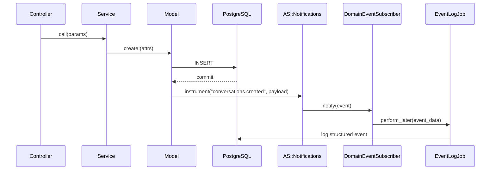

# Remesh Take-Home

A server-rendered Rails 8 app for managing conversations, messages, and thoughts with full-text search. Built as a take-home project demonstrating conventional Rails MVC with a service layer, event-driven instrumentation, and thorough test coverage.

---

## Stack

| Layer | Technology |
|-------|-----------|
| Language | Ruby 3.3.0 |
| Framework | Rails 8.1.2 |
| Database | PostgreSQL 16 |
| CSS | Tailwind CSS v4 |
| Testing | RSpec 8, FactoryBot, shoulda-matchers |
| Coverage | SimpleCov |

---

## Prerequisites

- **Ruby 3.3.0** — recommend [rbenv](https://github.com/rbenv/rbenv) or [asdf](https://asdf-vm.com/)
- **PostgreSQL 16+** — must be running locally
- **Chrome or Chromium** — required for system (feature) tests

---

## Setup Instructions

```bash
git clone <repo-url>
cd remesh
bundle install
bin/rails db:create db:migrate
bin/rails db:seed    # optional — loads demo data to explore search
bin/dev              # starts Rails server + Tailwind CSS watcher
```

Visit [http://localhost:3000](http://localhost:3000)

---

## Running Tests

```bash
bundle exec rspec                    # full suite
COVERAGE=true bundle exec rspec      # with SimpleCov HTML coverage report
bundle exec rspec spec/models        # model layer only
bundle exec rspec spec/requests      # controller/request specs
bundle exec rspec spec/system        # end-to-end browser specs (Capybara + Chrome)
bundle exec rspec spec/services      # service object specs
bundle exec rspec spec/jobs          # ActiveJob specs
bundle exec rspec spec/subscribers   # event subscriber specs
```

Coverage report is written to `coverage/index.html` when `COVERAGE=true` is set.

---

## Architecture Overview



### Design Principles

- **Thin controllers** — controllers authenticate params, call a service, and redirect or render. No business logic.
- **Service objects** — `Conversations::Creator`, `Messages::Creator`, and `Thoughts::Creator` encapsulate creation logic and return a `ServiceResult` (success/failure + payload).
- **Models** — handle associations, validations, and search scopes (ILIKE with trigram indexes for case-insensitive partial-match search).
- **Server-rendered ERB views** with Tailwind CSS v4 utility classes. No JavaScript framework.

---

## Event / Instrumentation Pattern



### How It Works

Each model includes the `Publishable` concern. After a successful database commit, `after_commit on: :create` fires and calls `ActiveSupport::Notifications.instrument` with a namespaced event name (e.g., `conversations.created`, `messages.created`, `thoughts.created`).

`DomainEventSubscriber` subscribes to these namespaced events at boot time and enqueues `EventLogJob` for each event. The job logs structured event data asynchronously.

**Key design decisions:**

- Events fire **only after a successful commit** — no phantom events on rolled-back transactions.
- The subscriber pattern is an **extension point**: adding webhooks, analytics pipelines, or push notifications requires only a new subscriber or job, not touching the models or controllers.
- Jobs are async by default; in test mode they run inline so specs can assert on side effects.

---

## Future Scaling Considerations

- **Search** — replace ILIKE/trigram with PostgreSQL `tsvector` full-text search or an external service (Elasticsearch, Typesense) for high cardinality data.
- **Event bus** — replace `ActiveSupport::Notifications` with Kafka or RabbitMQ for high-throughput, multi-consumer event processing.
- **Database** — read replicas for reporting queries, PgBouncer for connection pooling, table partitioning for large message/thought tables.
- **Pagination** — Pagy or Kaminari; currently all records are returned which is fine for demo scope but would need pagination in production.

---

## Assumptions & Tradeoffs

### Assumptions

- **No authentication/authorization** — single-user context per the brief.
- **No conversation end date** — conversations are open-ended.
- **No pagination** — dataset size is small enough for demo purposes.

### Tradeoffs

| Decision | Chosen | Alternative | Reason |
|----------|--------|-------------|--------|
| Search | ILIKE + trigram indexes | Full-text `tsvector` | Simpler setup, sufficient for demo |
| Creation logic | Service objects for all creates | Fat models or inline controllers | Consistency and testability over minimalism |
| Pagination | None | Pagy/Kaminari | Clean demo UX; would add in production |
| Event timing | `after_commit` | `after_create` / inline | Guarantees no phantom events on rollback |

---

## AI Usage

**Tools Used:** Claude Code (Anthropic's CLI agent) running the Claude Opus model.

### Process

The emphasis was on **planning over coding**. The project began with a structured, prompt-engineered brief document (`remesh_take_home_llm_brief.md`) that defined requirements, architecture, and acceptance criteria upfront. **6–7 iterations were spent in plan mode** before any code was written, including:

- Design spec creation with an automated review pass
- Architecture decision exploration (service objects, event patterns, search approach)
- File structure mapping
- Test strategy design
- Implementation plan broken into bite-sized TDD tasks

### Prompt Categories

1. **Architecture design** — service layer structure, event/instrumentation patterns
2. **Test design** — comprehensive specs at model, request, service, job, subscriber, and system layers
3. **Domain modeling** — schema with indexes, foreign keys, trigram search
4. **Automated review** — spec review loops to verify completeness and correctness

### Representative Prompts

- **Initial brief:** a structured markdown document defining all requirements (see `remesh_take_home_llm_brief.md`)
- **Design iteration:** "Does the domain model and database design look correct?"
- **Architecture decision:** "Which implementation approach — full services + events, selective services, or no services?"

### Human Judgment

- Chose Tailwind CSS over bare HTML for professional presentation
- Designed seed data to exercise and demonstrate search capabilities
- Added architecture diagrams (Mermaid) beyond the brief requirements
- Reviewed and approved each design section before allowing implementation to proceed

### Challenges

- Balancing thoroughness with simplicity — resisted gold-plating while still demonstrating senior engineering patterns
- Keeping the event pattern lightweight so it serves as a clear extension point rather than unnecessary complexity
- Managing the tension between "senior engineering signals" (service objects, event-driven design) and YAGNI
